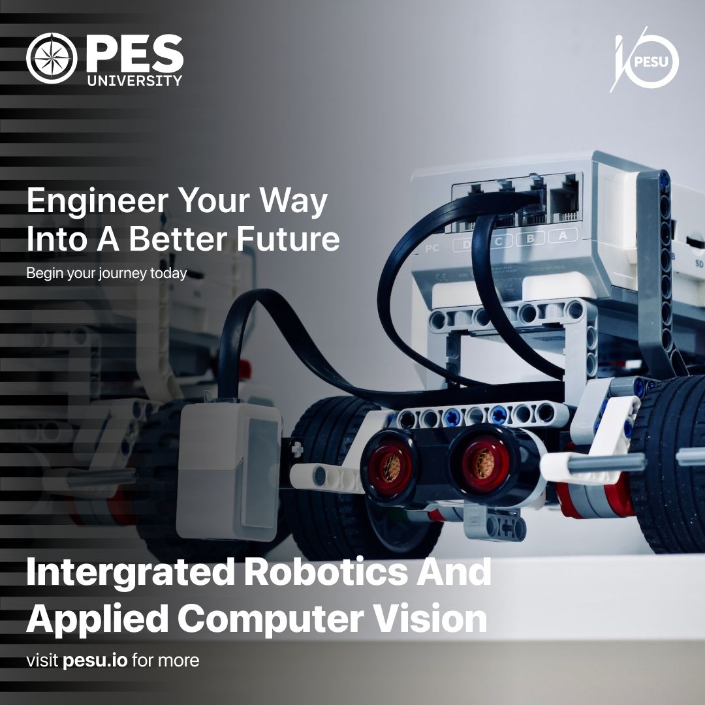

# scaling-spoon

A master repository containing all the SME issued material for the Integrated Robotics and Applied Computer Vision course of PESU IO Slot 14 (2022).



## Grading methodology :

- Day 1 is dedicated purely for set up. Your performance in the course will be evaluated for points from day 2.

- All submissions from then will be graded on a normal distribution. 

- Options will usually be given for each tasks defining a seperate one for exemplary performance. Completion of the tougher option of tasks each day (if applicable) will be awarded a perfect score.

- Task submissions where the code for the easier option (if applicable) is not working will be given a zero. This along with the highest score will define the upper and lower bounds of the bell curve. Don't worry about the number on your marks, this is just a temporary metric to determine your final grade.

- Points scored on the first half of the tasks given will be aggregated as your final score for Assignment 1 (25 points). The same will be done for Assignment 2 with the second half (25 points). This will constitute your in-course evaluation of 50 points.

- The final 50 points will be awarded based on your performance in the final project presentations, which will be evaluated for relevance to the topic (5), concept clarity (10), pitch appeal and presentation skill (10), technical complexity (10), and novelty (15).

- The final score will be calculated as the sum of the two assignments and the final project presentation. This is where we'll apply the bell curve to classify the students into three grade classes : C (completed satisfactorily), D (completed with distinction), and F (fail). 

- The fail bar (F) is set at a final score of 50/100. The distinction bar (D) is set at **two** standard deviations from the mean of the remainder (subject to change at the discretion of PESU IO management). The rest of the students will be awarded a C.

- Unofficially, there's a surprise in store for anyone scoring above **three** standard deviations from the mean from the side of the SMEs. Getting to this point truly demonstrates your dedication and passion for the subject and we'd like to make sure your efforts get the recognition they deserve.

- Don't worry about the exact number of your final score. It's nothing more than a tool to determine which grade bracket you fall into.


## day 1

### Topics covered :

- Introduction to Robotics and Computer Vision
- Introduction to Git, creating and cloning a repository
- Introduction to OpenCV
- Introduction to ROS
- Software installations

### Resources :

- ./day1
- OpenCV documentation : https://docs.opencv.org/4.x/
- ROS documentation : http://wiki.ros.org/Documentation
- Git cheat sheet : https://education.github.com/git-cheat-sheet-education.pdf

### Tasks : 

1. For your first task, you'll be required to follow the attached youtube video word for word to dual boot your computers to run Ubuntu 20.04. Be thorough, take backups if you want and do not screw this up because it will cost you more than just points.

Video link : https://www.youtube.com/watch?v=lGR_VNwUfzk&t=807s
Torrent download link for the ubuntu-20.04.5-desktop-amd64.iso disk image : https://releases.ubuntu.com/20.04/ubuntu-20.04.5-desktop-amd64.iso.torrent

For once you have your Ubuntu system up and running, I've written a shell executable that will -

Install ROS
Initialize your catkin workspace
Install and initialize the ROS packages you'll need later in the course
Install all of your python dependencies
Install VSCode on your systems
and update & reboot your computer.

Do not modify this executable. I've tested it more than once and can assure you that it will definitely work on a properly installed Ubuntu 20.04 system.

Connect your system to your home internet and follow these instructions to the dot to execute the script -


- Download and save the file under /home/your username/
- Navigate to /home/your username/ on the terminal
- Execute 'sudo chmod 777 IRACV-IO-setup' on the terminal
- Execute 'ls' on the terminal
- Verify that 'IRACV-IO-setup' appears in green on your terminal. Otherwise, redo step 3.
- Execute './IRACV-IO-setup >> IRACV-IO-setup-output.txt'
- Be on the lookout for user prompts during execution


Mail your 'IRACV-IO-setup-output.txt' (located under /home/<your username>/) as an attachment to samuelthomas1049@gmail.com and sriram.radhakrishna42@gmail.com by 14:30, November 1st, 2022.

This text file will tell us exactly what installation errors you guys have run into and will determine whether or not we will require an online session to resolve them.

This assignment will take anywhere between 20 to 45 minutes depending on how carefully you're following the instructions.

The ability to read thoroughly and debug system errors is an essential skill in robotics. You will not survive without it. Give every error it's due time for resolution. In case you run into them, post them on the group and hep each other out.

Good luck :)


2. For your second task, you'll be required to create a repository on your github account and clone it to your local machine. 

You'll then be required to make a commit (any) and push it to your remote repository. 

There's no deadline or mandatory requirement for this task. You can do it anytime you want. Show us your work in class for extra points.


Code :

- ./day1/IRACV-IO-setup : The shell script for the first task
- ./day1/opencvFeedLoading.py : A python script that loads a video feed from your webcam and displays it on your screen

## day 2

### Topics covered :

- Kernels and their usage in dilation & erosion.
- Grayscaling, gaussian blur & the reasons to use them. [HANDS ON]
- Matrix rotation transform demonstrated using warp perspective.
- Inserting shapes & text (to emphasize the visual attractiveness of computer vision software) [HANDS ON]
- Matrix stretch transform demonstrated by image slicing & resizing
- HSV color space & cylindrical representation demonstrated by color detection & masking.
- Laplacian operator in HSV space demonstrated by Canny edge detection.
- Contour detection
- ROS topics overview, publisher and subscriber 


### Resources :

- ./day2

### Tasks :

1. For your first task, you'll be required to detect the number of sides on all the polygons given in the picture ./day2/taskResources/shapes.JPG and display them appropriately on the screen.

2. Alternatively, if you think the first task is too simple for you, you can download the .mp4 file at ./day2/taskResources/test.mp4 of a track recorded from the perspective of an actual robot. Use the image processing techniques learned in this class to indicate which direction the robot must turn to at any given point in time. Completing this successfully will guarantee you a perfect score for this task and potentially, all of assignment 1.

Submit either of these in the form of a .mp4 file recording the execution and email it to the SMEs.

Good luck :)


## day 3

### Topics covered :

- What is a neuron?
- What is a neural network?
- A conversation on summation in NNs
- A conversation on gradient descent
- A conversation on activation function
- A conversation on forward propagation & backpropagation
- ROS services [HANDS ON]
- Creating custom messages [HANDS ON]
- Introduction to TurtleSim


### Resources :

- ./day3
- UE20CS302 - Machine Intelligence course (PESU)

### Tasks :

1. Draw any shape in Turtlesim using teleop node. The usage of algorithms to generate complex drawings will be a strong criterion for grading. Record the execution of the same and email the .mp4 file to the SMEs.

2. For your second task, you'll be required to complete this kaggle notebook to identify handwritten digits using an ANN by adding visualizations for training & validation loss and error. 

https://www.kaggle.com/code/rupeshs/mnist-baseline-without-cnn/notebook

Alternatively, you could also write a CNN based image classifier for the following dataset - 

https://www.kaggle.com/datasets/ivanfel/honey-bee-pollen

Push your fully executed notebook to your github repository and email the link to the SMEs. Make sure your repository is public.

This task is optional but completion with the previous one will guarantee you a perfect score for this task and potentially, all of assignment 1.

Good luck :)


## day 4

### Topics covered :

- Gazebo Setup
- Using RViz to create visualizations in Gazebo [HANDS ON]
- TurtleSim control with nodes
- A brief conversation about convolutions in neural networks (as a break from the robotic systems)
- Using teleop and nodes for motion control
- Implementing laser scan and cmd_vel topics for pose estimation and obstacle detection


### Resources :

- ./day4


### Tasks :

1. 

## day 5

### Topics covered :

- What is transfer learning in the context of neural networks?
- A case study of MobileNetV2
- Booting up an AWS EC2 instance [HANDS ON]
- SSH controls 
- Building pipelines
- Error Control, Rise time, Peak overshoot
- P, PI, PD and PID controllers
- PID tuning using turtlesim

### Resources :

- ./day5
- Creating an AWS EC2 instance : https://www.javatpoint.com/aws-ec2-creating-an-instance
- Connecting to an AWS EC2 instance using SSH : https://www.clickittech.com/aws/connect-ec2-instance-using-ssh/
- Copying directories to your remote system using scp : https://medium.com/srcecde/copy-file-directory-to-from-ec2-using-scp-secure-copy-685c46636399

- Connection ...

```ssh -i file.pem username@ip-address ```


### Tasks :

1. 

## day 6

### Topics covered :

-Segway into mediapipe as the deep learning section of computer vision 
 - Introduction to mediapipe with neural networks & convolution at a high level.
 - Emphasis on mediapipe as a collection of ML solutions and not models (hence the light processing load), mention of bounding box classifiers.
 - Mediapipe documentation review
 - Landmarks
 - Hand tracking module [HANDS ON]
 - Pose estimation module [HANDS ON]
 - Using PID to control motion 
 - Deploying a ROS node to control motion in a pre-set manner while integrating PID controllers [HANDS ON]
 - Laser Scan integration for obstacle detection
 - Hector quadrotor understanding

### Resources :

- ./day6
- 

### Tasks :

1.For your first task, write a program to count the number of fingers you hold up against the camera and display the number on the screen. 

2. If you wish, you can expand on the previous task to detect whether or not you're holding up rock, paper or scissors, generate a random equivalent from the computer's side and display the winner on the screen. This will be the criterion for a guaranteed perfect score for this task.

## day 7

### Topics covered :

- Running a CV algorithm on a ROS node
- Implementing PID in hector quadrotor 

### Resources :

- ./day7

### Tasks :

1. Spawn a turtlebot.

2. Spawn a hector quadrotor

3. Demonstrate coke can detection on Gazebo using the quadrotor

4. PID tuning in hector quadrotor 

5. Integration of the motion and vision stacks


## day 8

### Topics covered :

- N/A. Time to focus on the projects.

### Resources :

- N/A

### Tasks :

1. Have an execution plan for the project.
2. Have a codebase ready for the same.
3. Have a specific set of targets to achieve to define the project’s completion.
4. Complete 65% of the project with respect to the total number of lines of code.


## day 9

### Topics covered :

- N/A. Time to focus on the projects.

### Resources :

- N/A

### Tasks :

1. Students present their final projects
2. All projects must be evaluated by the SME
